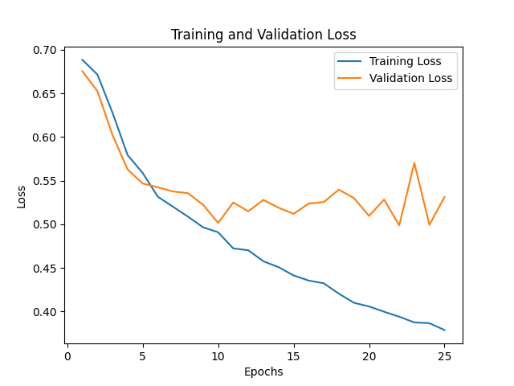
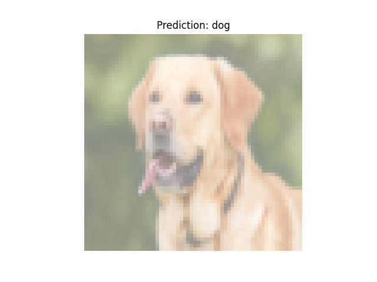
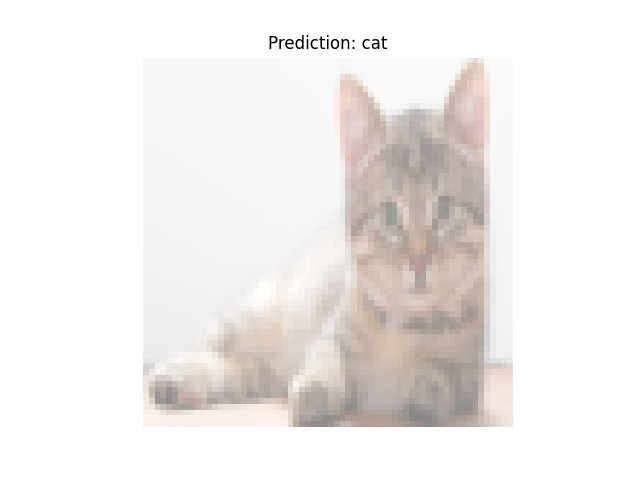

# Cats vs Dogs Classification using CNN

## Index
1. [Introduction](#introduction)
2. [Dataset and Preprocessing](#dataset-and-preprocessing)
3. [Model Architecture and Training](#model-architecture-and-training)
4. [Results and Discussion](#results-and-discussion)
5. [Conclusion](#conclusion)
6. [References](#references)

## Introduction
This project involves building and training a Convolutional Neural Network (CNN) to classify images of cats and dogs. The goal is to create a simple yet effective model that can differentiate between cats and dogs based on images from the popular Kaggle dataset "Dogs vs Cats". The model is built and trained using PyTorch, and the training process is evaluated using accuracy and loss metrics.

## Dataset and Preprocessing
The dataset used in this project is the [Dogs vs Cats dataset from Kaggle](https://www.kaggle.com/c/dogs-vs-cats/data). This dataset contains labeled images of cats and dogs, and the task is to classify each image as either a cat or a dog.

- **Training Set**: Contains labeled images of cats and dogs.
- **Test Set**: Contains unseen images used to validate the model's performance.

The dataset is not perfect, as it contains some misclassified images (e.g., dogs classified as cats and vice versa) and irrelevant images like logos. Cleaning the dataset was not done for this project to keep the exercise simple. Using a pre-trained model like CLIP could help classify and clean up the dataset with less effort.

Data preprocessing includes:
- **Resizing** the images to 64x64 pixels.
- **Data Augmentation**: Random horizontal flips, rotations, and resized crops are applied to the training data to improve generalization.
- **Normalization**: The images are normalized to the range [0, 1].

Below are the transformations applied to the training and test sets:
- **Training Set Transformations**: Resizing, random horizontal flip, random rotation, random resized crop, conversion to tensor, and normalization.
- **Test Set Transformations**: Resizing, conversion to tensor, and normalization.

## Model Architecture and Training
The model used is a Convolutional Neural Network (CNN) built with PyTorch. The architecture consists of:
- **Two Convolutional Layers** followed by **Max Pooling** to extract features from the images.
- **Two Fully Connected Layers**: The first one reduces the feature map to 128 units, and the second outputs the probability of the image being either a cat or a dog using a sigmoid activation function.

### Training
The model was trained for 25 epochs using the Adam optimizer with a learning rate of 0.001, and Binary Cross-Entropy Loss was used as the loss function. The model was trained using a batch size of 32, and both training and validation losses were tracked for analysis.

The following hyperparameters were used:
- **Batch Size**: 32
- **Learning Rate**: 0.001
- **Number of Epochs**: 25

## Results and Discussion
The training and validation loss curves for 25 epochs are shown below:

The model's training accuracy and validation accuracy improved over the epochs. Here are some selected epochs to show the improvement:
- **Epoch 1**: Training Accuracy = 54.89%, Validation Accuracy = 58.50%
- **Epoch 5**: Training Accuracy = 70.95%, Validation Accuracy = 72.65%
- **Epoch 10**: Training Accuracy = 76.35%, Validation Accuracy = 75.90%
- **Epoch 15**: Training Accuracy = 78.79%, Validation Accuracy = 76.00%
- **Epoch 20**: Training Accuracy = 81.46%, Validation Accuracy = 76.50%
- **Epoch 25**: Training Accuracy = 82.83%, Validation Accuracy = 77.00%

The training accuracy reaches over 82% by the end of the 25th epoch, indicating good learning on the training data. The validation accuracy stabilizes around 76-77%, which suggests that the model still struggles to generalize to new, unseen data, likely due to overfitting. Overfitting can be mitigated by implementing techniques such as dropout layers, using a pre-trained model, or adding more diverse training data.

### Visualizing Predictions
The model was also used to predict two images of a cat and a dog. Below are the results:

 

Other images could easily be used to test the model. But as can be seen, the model while simple is actually able to performe reasonably well.

## Conclusion
This project demonstrates how a Convolutional Neural Network can be used to classify images of cats and dogs. Although the model achieves good training accuracy, it still suffers from overfitting and struggles to generalize well to the validation set, achieving around 77% validation accuracy, which, while high could still be improved. Future work could include implementing regularization techniques such as dropout layers, utilizing a pre-trained model like CLIP, or improving data augmentation to enhance the model's generalization capability.

## References
1. [Dogs vs Cats dataset - Kaggle](https://www.kaggle.com/c/dogs-vs-cats/data)
2. Machine Learning A-Z: AI, Python & R [2024]  
Created by Hadelin de Ponteves, Kirill Eremenko, SuperDataScience Team, and the Ligency Team  
[https://www.udemy.com/course/machinelearning/](https://www.udemy.com/course/machinelearning/)

